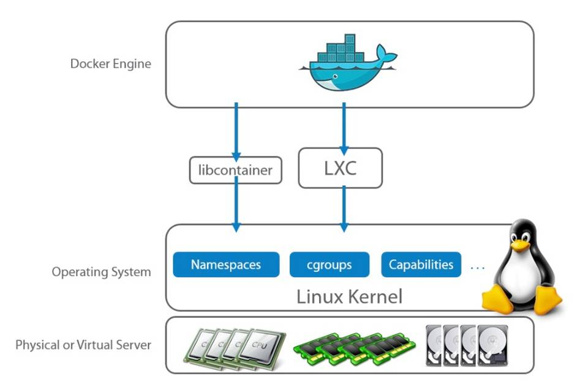

- [chroot](#orgd86181d)
- [chroot](#org8b76e6d)
- [virtual machine](#org0cc7e89)
- [vagrant](#org0410561)
- [Linux Namespaces](#orgd00a909)
- [Docker](#org607ed23)
- [Слои](#org7fed6d6)
- [Где всё на самом деле хранится?](#orga52996c)
- [Как попасть на запущенный контейнер?](#orgb8d68a1)
- [NAT (Network Adress Translation)](#orgccd6815)
- [Собрать свой образ с нуля?](#org560714a)
- [Запустить контейнер с графической системой?](#org0553a78)
- [Запустить контейнер в контейнере?](#org86a3f24)
- [Дополнительная литература](#orgc4bb8e8)
- [Вопросы-ответы](#orgc8e78f6)


<a id="orgd86181d"></a>

# chroot

Запустим Python в chroot

```shell
echo -e "$(ldd /usr/bin/python3 | \
     egrep -o '/lib.*\.[0-9]')"
```

    /lib/x86_64-linux-gnu/libc.so.6
    /lib/x86_64-linux-gnu/libpthread.so.0
    /lib/x86_64-linux-gnu/libdl.so.2
    /lib/x86_64-linux-gnu/libutil.so.1
    /lib/x86_64-linux-gnu/libm.so.6
    /lib/x86_64-linux-gnu/libexpat.so.1
    /lib/x86_64-linux-gnu/libz.so.1
    /lib64/ld-linux-x86-64.so.2


<a id="org8b76e6d"></a>

# chroot

```shell
copy_to_chroot () {
  local name="${1}"
  mkdir -p $(dirname "chroot${name}")
  for i in $(ldd ${name} | \
      grep -o '/lib.*\.[0-9]'); do
    echo "chroot${i}"
    mkdir -p $(dirname "chroot${i}")
    /bin/cp $i "chroot${i}";
  done
  mkdir -p chroot/bin
  /bin/cp ${name} chroot/bin/
}
```


<a id="org0cc7e89"></a>

# virtual machine

<vbox.sh>


<a id="org0410561"></a>

# vagrant

```shell
mkdir vagrant_project
cd vagrant_project
vagrant init generic/ubuntu2004
vagrant up
```


<a id="orgd00a909"></a>

# Linux Namespaces

<span class="underline"><span class="underline">[TryTry](https://github.com/imankulov/trytry)</span></span>


<a id="org607ed23"></a>

# Docker




<a id="org7fed6d6"></a>

# Слои


<a id="orga52996c"></a>

# Где всё на самом деле хранится?

    /var/lib/docker

```shell
docker system df
```

    - TYPE            TOTAL     ACTIVE    SIZE      RECLAIMABLE
    - Images          5         3         1.374GB   1.141GB (83%)
    - Containers      3         3         488.3kB   0B (0%)
    - Local Volumes   5         3         127.5MB   82.42MB (64%)
    - Build Cache     23        0         43.02kB   43.02kB


<a id="orgb8d68a1"></a>

# Как попасть на запущенный контейнер?

Если вы не настроили доступ по SSH на контейнер, то всегда можно туда зайти таким способом

```shell
docker exec -it <node> /bin/bash
```


<a id="orgccd6815"></a>

# NAT (Network Adress Translation)

IPv4-адресов мало, а портов ещё меньше!


<a id="org560714a"></a>

# Собрать свой образ с нуля?

<span class="underline"><span class="underline">[baseimage](https://docs.docker.com/develop/develop-images/baseimages/)</span></span>


<a id="org0553a78"></a>

# Запустить контейнер с графической системой?

<span class="underline"><span class="underline">[Можно](https://www.cloudsavvyit.com/10520/how-to-run-gui-applications-in-a-docker-container/)</span></span>


<a id="org86a3f24"></a>

# Запустить контейнер в контейнере?

-   в Linux точно <span class="underline"><span class="underline">[можно](https://jpetazzo.github.io/2015/09/03/do-not-use-docker-in-docker-for-ci/)</span></span>
-   лучше так не делать (могут возникнуть технические сложности)
-   это может быть нужно когда у тебя CI система сама запускает сборку в контейнере, а в процессе сборки может создавать контейнер. тогда надо просто <span class="underline"><span class="underline">[пробрасывать docker daemon из хоста](https://itnext.io/docker-in-docker-521958d34efd?gi=a966915566a0)</span></span>


<a id="orgc4bb8e8"></a>

# Дополнительная литература

-   <span class="underline"><span class="underline">[namespaces](https://habr.com/ru/company/selectel/blog/279281/)</span></span>
-   <span class="underline"><span class="underline">[cgroups](https://habr.com/ru/company/selectel/blog/303190/)</span></span>
-   <span class="underline"><span class="underline">[Linux контейнеры](https://habr.com/ru/company/redhatrussia/blog/352052/)</span></span>
-   <span class="underline"><span class="underline">[Образы и контейнеры Docker в картинках](https://habr.com/ru/post/272145/)</span></span>


<a id="orgc8e78f6"></a>

# Вопросы-ответы


